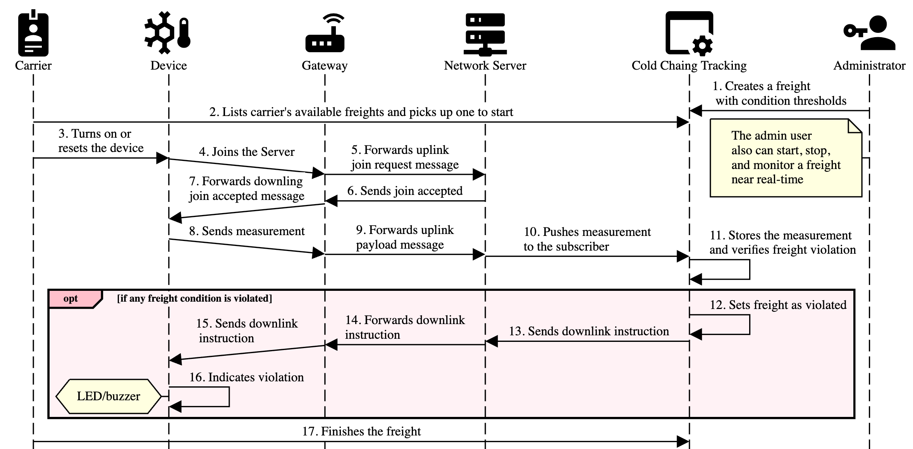

# Cold Chain Tracking

This is the Cold Chain Tracking application, a Java Spring Boot 3 microservice with web views using Vaadin framework.

It connects to MQTT brokers to process end device measurements coming from KPN and TTN (The Things Network).

## Arduino

The Arduino source code for the end devices in versioned on the
[arduino/cold_chain_tracking_end_device.ino](arduino/cold_chain_tracking_end_device.ino) file.

Follow the file header instructions and change the `FILLMEIN` references with the device's OTAA values.

## Configuration

Environment variables required to connect to the Network Servers KPN and TTN are:

- KPN_GRIP_APPLICATION_ID
- KPN_GRIP_CLIENT_ID
- KPN_GRIP_CLIENT_SECRET
- KPN_GRIP_TENANT_ID
- KPN_THINGS_CLIENT_ID
- TTN_STACK_APPLICATION_ID
- TTN_STACK_MQTT_PASSWORD
- TTN_STACK_TENANT_ID
- TTN_STACK_TOKEN
- GOOGLE_GEOLOCATION_API_KEY

## Running the application

The project is a standard Maven project. To run it from the command line,
type `mvnw` (Windows), or `./mvnw` (Mac & Linux), then open
http://localhost:8080 in your browser.

You can also import the project to your IDE of choice as you would with any
Maven project. Read more on [how to import Vaadin projects to different IDEs](https://vaadin.com/docs/latest/guide/step-by-step/importing) (Eclipse, IntelliJ IDEA, NetBeans, and VS Code).

### User Log in

The `admin` and `carrier` user credentials are created using the
[migration file](src/main/resources/db/migration/V1_0_1__INITIAL_DML.sql). Use them to log in into the application.

## Deploying to Production

To create a production build, call `mvnw clean package -Pproduction` (Windows),
or `./mvnw clean package -Pproduction` (Mac & Linux).
This will build a JAR file with all the dependencies and front-end resources,
ready to be deployed. The file can be found in the `target` folder after the build completes.

Once the JAR file is built, you can run it using
`java -jar target/cold-chain-tracking-1.0-SNAPSHOT.jar`

## Project structure

- `MainLayout.java` in `src/main/java` contains the navigation setup (i.e., the
  side/top bar and the main menu). This setup uses
  [App Layout](https://vaadin.com/docs/components/app-layout).
- `views` package in `src/main/java` contains the server-side Java views of your application.
- `views` folder in `frontend/` contains the client-side JavaScript views of your application.
- `themes` folder in `frontend/` contains the custom CSS styles.

## Useful links

- Read the documentation at [vaadin.com/docs](https://vaadin.com/docs).
- Follow the tutorial at [vaadin.com/docs/latest/tutorial/overview](https://vaadin.com/docs/latest/tutorial/overview).
- Create new projects at [start.vaadin.com](https://start.vaadin.com/).
- Search UI components and their usage examples at [vaadin.com/docs/latest/components](https://vaadin.com/docs/latest/components).
- View use case applications that demonstrate Vaadin capabilities at [vaadin.com/examples-and-demos](https://vaadin.com/examples-and-demos).
- Build any UI without custom CSS by discovering Vaadin's set of [CSS utility classes](https://vaadin.com/docs/styling/lumo/utility-classes). 
- Find a collection of solutions to common use cases at [cookbook.vaadin.com](https://cookbook.vaadin.com/).
- Find add-ons at [vaadin.com/directory](https://vaadin.com/directory).
- Ask questions on [Stack Overflow](https://stackoverflow.com/questions/tagged/vaadin) or join our [Discord channel](https://discord.gg/MYFq5RTbBn).
- Report issues, create pull requests in [GitHub](https://github.com/vaadin).
